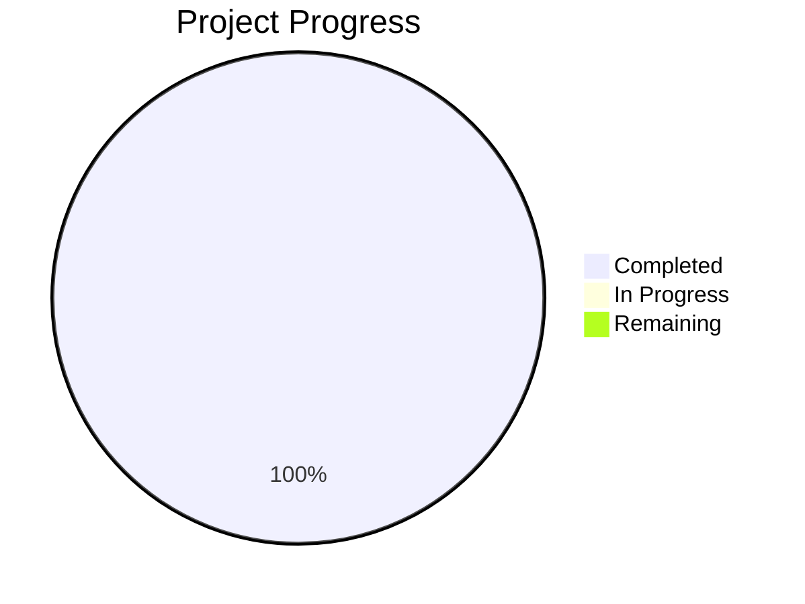

# Project State: Predictive Poultry Systems

## Project Reference

**Core Value**: High-fidelity Digital Twin simulation to optimize poultry fulfillment nodes.

**Current Focus**: Phase 6 Custom Engine Research.

## Current Position

**Phase**: 07 - Data & Metrics Foundation
**Plan**: 07-01-PLAN.md, 07-02-PLAN.md
**Status**: Phase 07 complete. All must-haves verified.

> Note: Progress represents completion of planned phases (5/5 core + 2/2 expansion). Core simulation and data foundation are solid.

## Performance Metrics
- **Phase Completion**: 100% (7/7 phases complete)
- **Requirement Coverage**: 100% (Mapped to Phases)

## Accumulated Context

### Decisions
- [D-01] loguru for logging.
- [D-02] salabim monitors for data collection.
- [D-03] direct sqlite3 for database.
- [D-04] relational/normalized schema in SQLite.
- [D-05] real-time synchronous database writes.
- [D-06] Robust type checks for salabim components using type(obj).__name__ and 'is not None'.

### Todos
- [ ] Audit Phase 07 performance with larger simulation till times.
- [ ] Explore Phase 08: Economic Layer implementation.

### Blockers
- None.

### Roadmap Evolution
- Phase 6 pivoted from a thermodynamic simulation engine to an economic and management-focused layer.
- Phase 7 implemented the data foundation for economic analysis.

## Session Continuity
- **Last Action**: Completed Phase 07 execution and verification. Fixed critical bug in MetricSink where empty Stores/Queues evaluated to False.
- **Next Step**: Audit project milestones or start Phase 08 planning.
