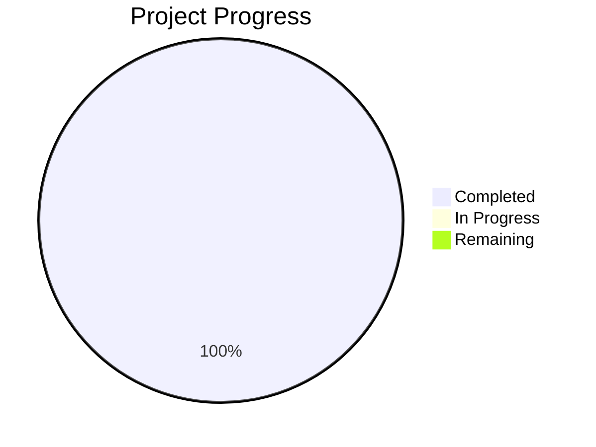

# Project State: Predictive Poultry Systems

## Project Reference

**Core Value**: High-fidelity Digital Twin simulation to optimize poultry fulfillment nodes.

**Current Focus**: Phase 6 Custom Engine Research.

## Current Position

**Phase**: 7
**Plan**: TBD
**Status**: Phase 6 complete. Ready to plan Phase 7: Data & Metrics Foundation.

> Note: Progress represents completion of planned phases (5/5 core). Phase 6 & 7 are expansion research. Phase 6 is now complete.

## Performance Metrics
- **Phase Completion**: 100% (5/5 core phases complete)
- **Requirement Coverage**: 100% (Mapped to Phases)

## Accumulated Context

### Decisions
- [D-01] Custom Minimal BT implementation.
- [D-02] Decoupled Logic and Time.
- [D-03] Hybrid LLM/Rules approach.
- [D-04] LLM for Menu, Satisfaction, Morale, and Interaction Quality.
- [D-05] pydantic-ai as the LLM interface (v1.77.0).
- [D-06] Provider-agnostic inference support using OpenAIChatModel and OpenAIProvider.
- [D-07] BT integrated with Pydantic models.
- [D-08] Simulation uses salabim.Component for agent lifecycle.
- [D-09] Fulfillment cycle follows a pull-based logic from the Holding Cabinet.
- [D-10] Use FulfillmentManager to centralize sim.Monitor and sim.LevelMonitor.
- [D-11] Automated fulfillment auditing at simulation end.
- [D-12] Throughput defined as "completed fulfillment cycles per hour".
- [D-13] Future engine/layer to focus on management, economics, inventory, and labor scaling.

### Todos
- [ ] Plan Phase 7: Data & Metrics Foundation.
- [ ] Set up SQLite integration for ledger and performance monitoring.

### Blockers
- None.

### Roadmap Evolution
- Phase 6 pivoted from a thermodynamic simulation engine to an economic and management-focused layer, accurately reflecting the core business value of running a chicken shop.

## Session Continuity
- **Last Action**: Transitioned Phase 06 focus from physics to economics. Drafted ECONOMIC_DESIGN.md and updated ROADMAP.md.
- **Next Step**: Plan Phase 07: Data & Metrics Foundation (`/gsd:plan-phase 07`).
