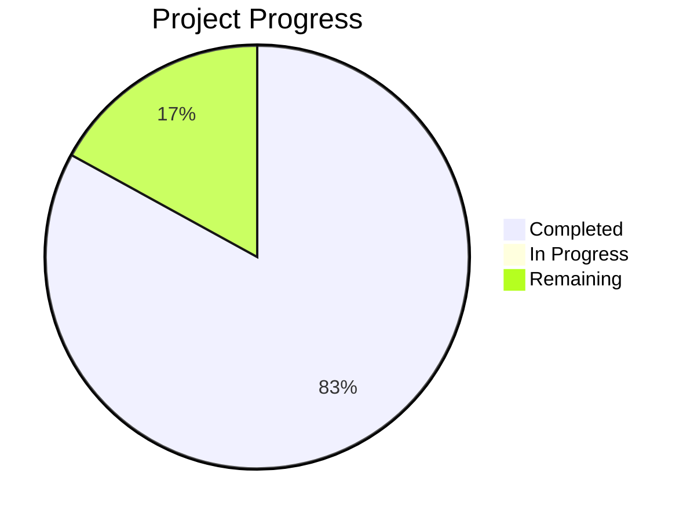

# Project State: Predictive Poultry Systems

## Project Reference

**Core Value**: High-fidelity Digital Twin simulation to optimize poultry fulfillment nodes.

**Current Focus**: Phase 5 Throughput Optimization.

## Current Position

**Phase**: 5
**Plan**: TBD
**Status**: Phase 4 complete. Ready to plan Phase 5: Throughput Optimization.

## Performance Metrics
- **Phase Completion**: 83% (5/6 complete)
- **Requirement Coverage**: 100% (Mapped to Phases)

## Accumulated Context

### Decisions
- [D-01] Custom Minimal BT implementation.
- [D-02] Decoupled Logic and Time.
- [D-03] Hybrid LLM/Rules approach.
- [D-04] LLM for Menu, Satisfaction, Morale, and Interaction Quality.
- [D-05] pydantic-ai as the LLM interface (v1.77.0).
- [D-06] Provider-agnostic inference support using OpenAIChatModel and OpenAIProvider.
- [D-07] BT integrated with Pydantic models.
- [D-08] Simulation uses salabim.Component for agent lifecycle.
- [D-09] Fulfillment cycle follows a pull-based logic from the Holding Cabinet.

### Todos
- [ ] Create Phase 5 plan.
- [ ] Implement performance metrics (throughput, satisfaction, fiscal yield).
- [ ] Implement "Crisp-state" thermodynamic optimum tracking.

### Blockers
- None.

### Roadmap Evolution
- Phase 4 successfully integrated behavioral agents with physical resources, proving the end-to-end pull-based fulfillment cycle.

## Session Continuity
- **Last Action**: Phase 04 execution and verification completed. ROADMAP.md and STATE.md updated.
- **Next Step**: Plan Phase 05: Throughput Optimization (`/gsd:plan-phase 05`).
