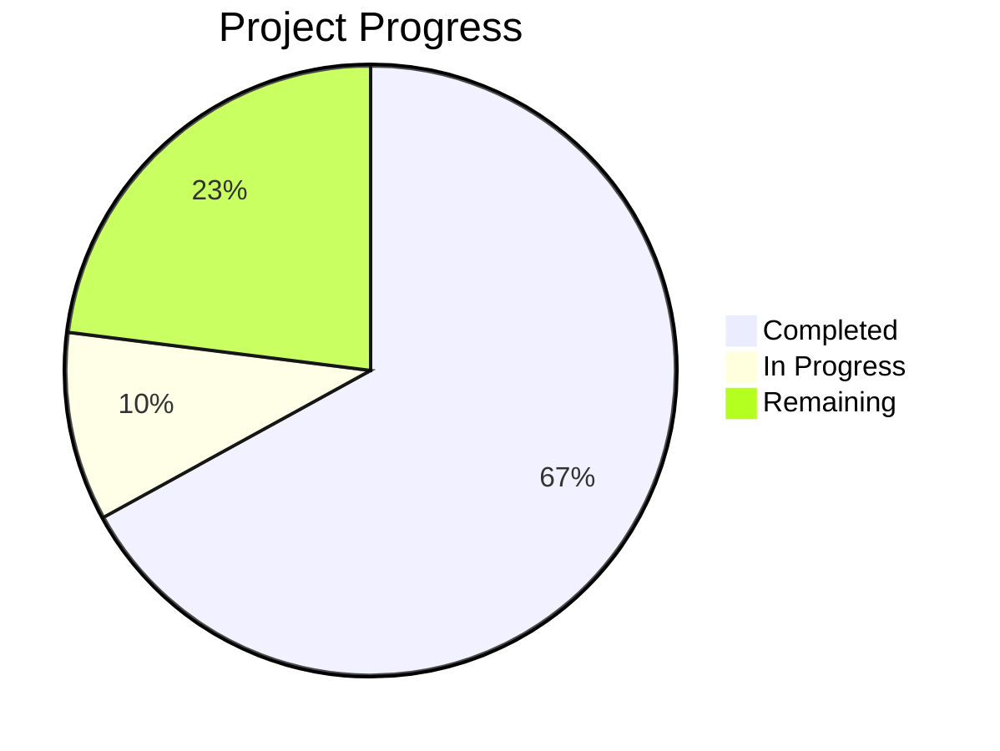

# Project State: Predictive Poultry Systems

## Project Reference

**Core Value**: High-fidelity Digital Twin simulation to optimize poultry fulfillment nodes.

**Current Focus**: Phase 4 Cycle Integration.

## Current Position

**Phase**: 4
**Plan**: 04-01
**Status**: Phase 4 planned (2 plans). Ready to execute 04-01: Agent Behavioral Lifecycle Logic.

## Performance Metrics
- **Phase Completion**: 67% (4/6 complete)
- **Requirement Coverage**: 100% (Mapped to Phases)

## Accumulated Context

### Decisions
- [D-01] Custom Minimal BT implementation.
- [D-02] Decoupled Logic and Time.
- [D-03] Hybrid LLM/Rules approach.
- [D-04] LLM for Menu, Satisfaction, Morale, and Interaction Quality.
- [D-05] pydantic-ai as the LLM interface (v1.77.0).
- [D-06] Provider-agnostic inference support using OpenAIChatModel and OpenAIProvider.
- [D-07] BT integrated with Pydantic models.
- [D-08] Simulation uses salabim.Component for agent lifecycle.

### Todos
- [ ] Execute Phase 4 plans (04-01, 04-02).
- [ ] Implement full cycle: Arrival -> Ordering -> Cooking -> Delivery.
- [ ] Integrate facility resources with agent behaviors.

### Blockers
- None.

### Roadmap Evolution
- Phase 4 broken down into 2 executable plans: Agent Behavioral Lifecycle Logic and End-to-End Simulation Loop Integration.

## Session Continuity
- **Last Action**: Phase 04 research and planning completed. ROADMAP.md and STATE.md updated.
- **Next Step**: Execute Phase 04: Cycle Integration (`/gsd:execute-phase 04`).
