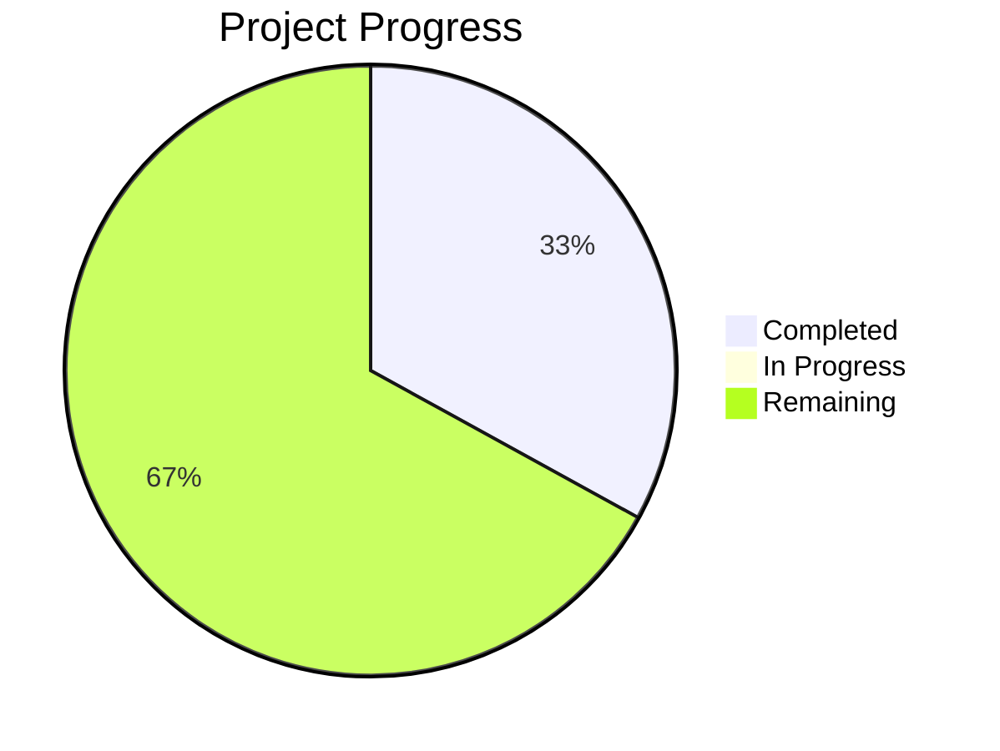

# Project State: Predictive Poultry Systems

## Project Reference

**Core Value**: High-fidelity Digital Twin simulation to optimize poultry fulfillment nodes.

**Current Focus**: Phase 3 Agentic Workforce & Logistics.

## Current Position

**Phase**: 3
**Plan**: TBD
**Status**: Phase 2 complete. Ready to plan Phase 3: Agentic Workforce & Logistics.

## Performance Metrics
- **Phase Completion**: 33% (2/6 complete)
- **Requirement Coverage**: 100% (Mapped to Phases)

## Accumulated Context

### Decisions
- High-fidelity assets modeled using Pydantic in `src/predictive_poultry_systems/objects/`.
- Processes (Thermodynamic and Assembly) defined to bridge machines, ingredients, and staff.
- Staff fatigue and skill levels modeled for labor simulation.
- Facility capacity constraints implemented.

### Todos
- [ ] Create Phase 3 plan.
- [ ] Implement Customer behavior models (loyalty, segmentation, RFM).
- [ ] Implement Staff fulfillment logic (salabim Component processes).

### Blockers
- None.

## Session Continuity
- **Last Action**: Phase 03 context gathered and decisions captured in `.planning/phases/03-agentic-workforce-logistics/03-CONTEXT.md`.
- **Next Step**: Start Planning for Phase 03 (`/gsd:plan-phase 03`).
