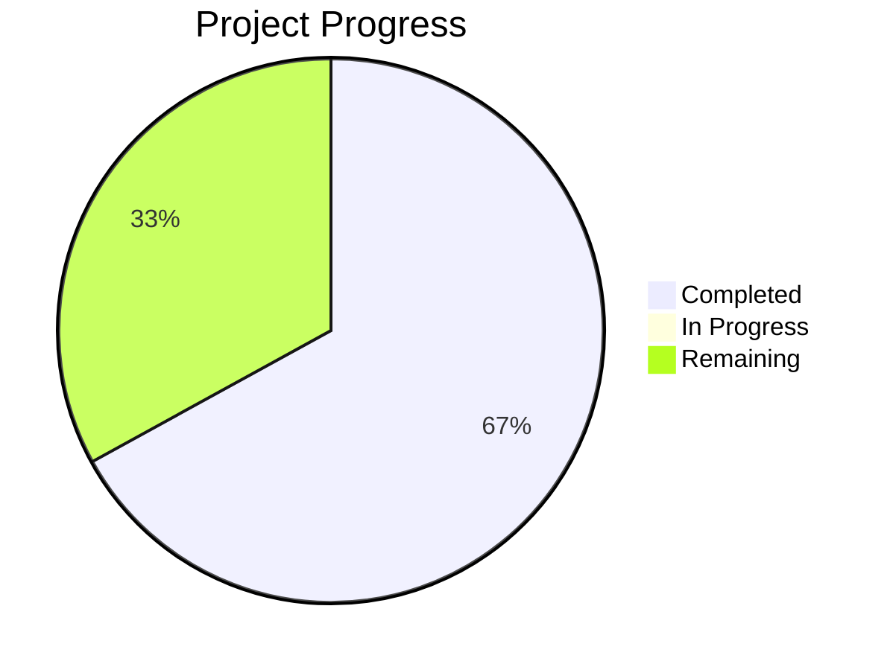

# Project State: Predictive Poultry Systems

## Project Reference

**Core Value**: High-fidelity Digital Twin simulation to optimize poultry fulfillment nodes.

**Current Focus**: Phase 3 Agentic Workforce & Logistics.

## Current Position

**Phase**: 4
**Plan**: TBD
**Status**: Phase 3 complete. Ready to plan Phase 4: Cycle Integration.

## Performance Metrics
- **Phase Completion**: 67% (4/6 complete)
- **Requirement Coverage**: 100% (Mapped to Phases)

## Accumulated Context

### Decisions
- [D-01] Custom Minimal BT implementation.
- [D-02] Decoupled Logic and Time.
- [D-03] Hybrid LLM/Rules approach.
- [D-04] LLM for Menu, Satisfaction, Morale, and Interaction Quality.
- [D-05] pydantic-ai as the LLM interface (v1.77.0).
- [D-06] Provider-agnostic inference support using OpenAIChatModel and OpenAIProvider.
- [D-07] BT integrated with Pydantic models.

### Todos
- [ ] Create Phase 4 plan.
- [ ] Implement end-to-end fulfillment loop (arrival -> ordering -> cooking -> delivery).
- [ ] Integrate facility resources (queues, machines) with agent behaviors.

### Blockers
- None.

### Roadmap Evolution
- Phase 3 broken down into 3 executable plans: Core Behavior Framework, Agent Behavior Definitions, and Simulation Loop Integration.

## Session Continuity
- **Last Action**: Phase 03 planning completed. ROADMAP.md and STATE.md updated.
- **Next Step**: Execute Phase 03: Agentic Workforce & Logistics (`/gsd:execute-phase 03`).
